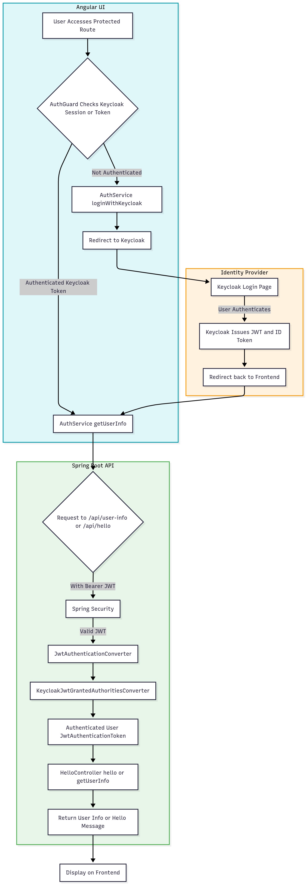

# Secure Hello UI - Angular Application


Secure Hello UI is an Angular application that demonstrates secure authentication flows using Keycloak and Google OAuth2 with a Spring Boot backend.

## Table of Contents
1. [Features](#features)
2. [Prerequisites](#prerequisites)
3. [Installation](#installation)
4. [Configuration](#configuration)
5. [Running the Application](#running-the-application)
6. [Authentication Flows](#authentication-flows)

## Features 
- Multi-provider authentication (Google OAuth2 + Keycloak)
- Protected routes with AuthGuard
- User profile management
- Secure API communication
- Silent SSO implementation
- Reactive state management
- Environment-specific configuration

## Prerequisites <a name="prerequisites"></a>
- Node.js v18+
- Angular CLI v17+
- Keycloak server
- Spring Boot backend
- Google OAuth2 credentials

## Installation 
```bash
git clone https://github.com/yourusername/secure-hello-ui.git
cd secure-hello-ui
npm install
npm install keycloak-angular keycloak-js
```

Configuration <a name="configuration"></a>

## Configure Keycloak:

Realm: secure-hello-realm

Client: secure-hello-client (public access)

Redirect URIs: http://localhost:4200/*

## Running the Application 
```bash
ng serve
```
Access at: http://localhost:4200

## Authentication Flows 


## Features
- User authentication with Keycloak
- Protected routes using Angular guards
- Fetching secured and public messages from backend services
- User profile display
- Modular Angular structure with standalone components

## Getting Started

### Prerequisites
- Node.js (v16 or higher recommended)
- npm (v8 or higher)
- Angular CLI (optional, for development)

### Installation
1. Clone the repository:
   ```sh
   git clone <repository-url>
   cd secure-hello-ui
   ```
2. Install dependencies:
   ```sh
   npm install
   ```

### Running the Application
Start the development server:
```sh
npm start
```
The app will be available at `http://localhost:4200/` by default.

## Authentication
This project uses Keycloak for authentication. Make sure your Keycloak server is running and the configuration in `keycloak-init.service.ts` matches your environment.

## Customization
- Update Keycloak settings in `keycloak-init.service.ts` as needed.
- Modify styles in `src/styles.scss` or component-specific SCSS files.

## License
This project is licensed under the MIT License.

